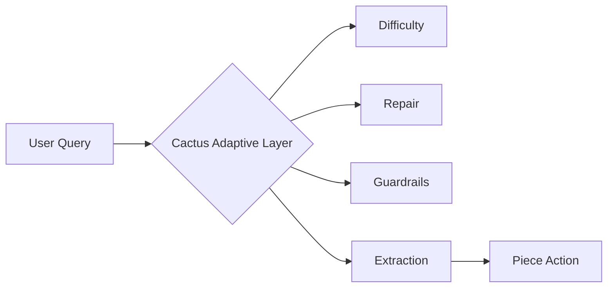

# Activepieces Agent OS: The Unified Tool Framework

Welcome to the **Activepieces Agent OS**, a research-backed framework designed to optimize the bridge between automated workflows and autonomous AI agents.

## 🚀 The Four Pillars of Agent OS

### 1. Cactus-Optimized Execution (Adaptive Routing)
Based on the **CactusRoute** 7-layer framework, every tool call in Activepieces is now optimized for the most reliable agentic experience:



- **Layer 1: Difficulty Estimation**: Automatically assesses query complexity to route to the most efficient model.
- **Layer 3: Adaptive Repair**: Auto-corrects common LLM mistakes like time formats and negative numbers.
- **Layer 4: Semantic Guardrails**: Real-time hallucination detection by cross-checking prompts against parameters.
- **Layer 7: Deterministic Fallback**: Regex-based extraction to rescue failed LLM tool calls directly from user intent.

### 2. NANDA Protocol Integration (Decentralized Discovery)
Activepieces implements the **NANDA Stack** for the Open Agentic Web:
- **AgentFacts (JSON-LD)**: Standardized discovery format for trillion-scale agent indexing.
- **Verified Trust Anchors**: Secure tool-sharing with explicit governance and reward models.
- **Standardized Pathing**: Discovery via `/.well-known/agent.json`.

### 3. Virtual Tool Orchestration (Guido Rule Engine)
Inspired by the **Guido** configuration manager, users can now build high-level "super-tools":
- **Tool Blending**: Aggregate properties from 280+ pieces into single optimized interfaces.
- **Conditional Validation**: Define logic-based rules (if-then-else) to ensure data integrity.
- **Negation & Pattern Matching**: Advanced support for `NOT`, `CONTAINS`, and nested path validation.

### 4. Multi-Model Tooling (Mistral & Beyond)
Deep integration with leading AI providers to ensure maximum compatibility:
- **Mistral Native Tooling**: Optimized support for Mistral Large, Small, and Codestral.
- **OpenAPI Auto-Import**: Dynamically generate MCP tools from any OpenAPI specification (inspired by `mcp-generator-2.0`).

## 🧩 New Framework Components

| Component | Purpose |
|-----------|---------|
| `cactus-utils.ts` | The neuro-symbolic engine for repair and validation. |
| `nanda-manifest-service.ts` | Generates the decentralized capability manifest. |
| `virtual-tool-service.ts` | Handles the blending of tools and rule execution. |
| `AI Agent Piece` | The user-facing bridge to trigger optimized workflows. |

## 🛠️ How to use the optimized metadata
Piece developers can now add AI-specific context to their actions:

```typescript
export const myAction = createAction({
  name: 'send_email',
  aiDescription: 'High-priority tool for sending notifications to users.',
  props: {
    email: Property.ShortText({
      displayName: 'Email',
      aiDescription: 'The recipient email address found in the user prompt.',
      examples: ['jules@example.com']
    })
  },
  // ...
})
```

## 📚 Resources
- **[Quickstart Guide](docs/agent-os/quickstart.md)**: 3-step setup for research-backed Agents.
- **[Sample Templates](examples/agent-os/)**: Example workflows for CRM, Support, and Discovery.
- **[CLI Reference](packages/cli/src/lib/commands/agent-optimize.ts)**: Optimization and Publishing commands.

## 🏥 Healthcare & Compliance (SMART on FHIR)
Activepieces Agent OS is now HIPAA-aligned through the **Proxy Smart** integration.
- **Secure PHI Access**: Use the `FHIR` piece to interact with clinical data via a stateless proxy.
- **Agent Governance**: The NANDA manifest automatically broadcasts compliance flags (`HIPAA`, `GDPR`) to ensure agents only use clinical tools in secure environments.

## ⚖️ License & Community
The Agent OS framework is released under the **MIT License**. We follow the **[Code of Conduct](CODE_OF_CONDUCT.md)** to ensure a welcoming environment for all researchers and developers.

- **[Contributing](docs/agent-os/CONTRIBUTING.md)**: Help us build the Internet of Agents.
- **[Security Policy](docs/agent-os/SECURITY.md)**: AI-specific security guardrails.

By combining robust metadata with adaptive execution and decentralized discovery, Activepieces is now the foundational operating system for the next generation of AI Agents.

## 🏗️ Technical Specification

### Layered Architecture
Agent OS is architected as a series of nested middleware layers that wrap standard piece execution:

1.  **Metadata Layer**: Enhances TypeBox schemas with `aiDescription` and `examples`.
2.  **Discovery Layer (NANDA)**: Negotiates capabilities via `/.well-known/agent.json`.
3.  **Governance Layer (Guido)**: Enforces business logic rules before execution.
4.  **Adaptive Layer (Cactus)**: Repairs LLM input and provides deterministic fallback.
5.  **Execution Layer**: Runs the piece action in an isolated sandbox.

### Protocol Interoperability
Agent OS is designed to be the "TCP/IP" of the agentic web:
- **MCP**: Tool-use protocol for LLMs.
- **AgentFacts**: Discovery protocol for federated indexing.
- **Cactus-Native**: High-reliability execution protocol.

```mermaid
graph TD
    subgraph "NANDA Network"
        Index[NANDA Index]
        Registry[Verified Trust Anchors]
    end

    subgraph "Activepieces Agent OS"
        Manifest[/.well-known/agent.json]
        Rules[Guido Rule Engine]
        Cactus[Cactus Adaptive Layer]
        Sandbox[Action Sandbox]
    end

    Index <--> Manifest
    Rules --> Cactus
    Cactus --> Sandbox
```
