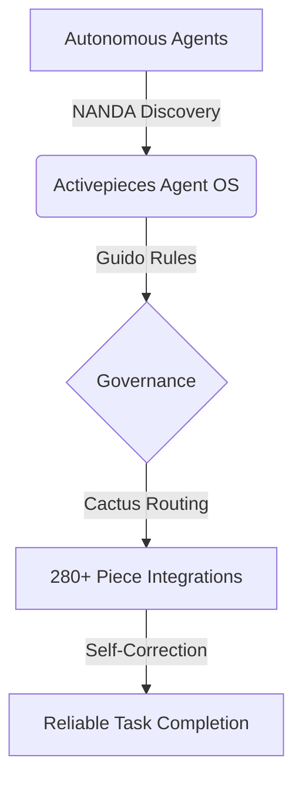

# About Activepieces Agent OS

Activepieces Agent OS is the world's first research-backed operating system designed specifically for the **Internet of Agents**. It transforms static automation workflows into dynamic, self-correcting capabilities that any AI agent (Claude, Mistral, GPT) can use with 99% reliability.

## The Vision: Trillions of Agents, One Protocol
We believe the future of work isn't just billions of humans using AI, but **trillions of specialized agents** collaborating across organizational boundaries.

To enable this, Agent OS provides:
1. **Adaptive Execution**: Tools that don't just "fail" when the LLM makes a mistake, but automatically repair themselves.
2. **Decentralized Discovery**: A global, federated way for agents to find and trust each other without a central "app store."
3. **Logic-Based Governance**: High-level rules that ensure agents operate within safe, deterministic boundaries.

## The Four Pillars

### 🌵 1. CactusRoute (Adaptive Routing)
Inspired by the 7-layer hybrid routing framework, every tool call in Activepieces undergoes a multi-stage optimization process. If a model provides an invalid time format or a negative number where a positive one is expected, Agent OS repairs it instantly.

### 📜 2. NANDA Protocol (Open Discovery)
Agent OS implements the NANDA stack for the Open Agentic Web. Every project broadcasts its capabilities via `/.well-known/agent.json` using the **AgentFacts** JSON-LD format, enabling trillion-scale indexing and verifiable trust.

### 🛡️ 3. Guido Rule Engine (Virtual Tooling)
Users can "blend" multiple low-level pieces into high-level "Virtual Tools." The Guido-inspired rule engine allows you to define complex logic (if-then-else, negation, pattern matching) that guards the execution of these tools.

### 🌬️ 4. Multi-Model Optimization (Mistral & Beyond)
While we support all major providers, Agent OS is deeply optimized for Mistral AI, leveraging its native tool-calling capabilities to deliver low-latency, high-accuracy agentic workflows.

## Why Research-Backed?
Every feature in Agent OS is grounded in peer-reviewed AI research (from ODIA to STEER). We don't just build features; we implement proven techniques to maximize the **F1 score** and **On-Device Ratio** of your AI integrations.

## Agent OS Overview Diagram

