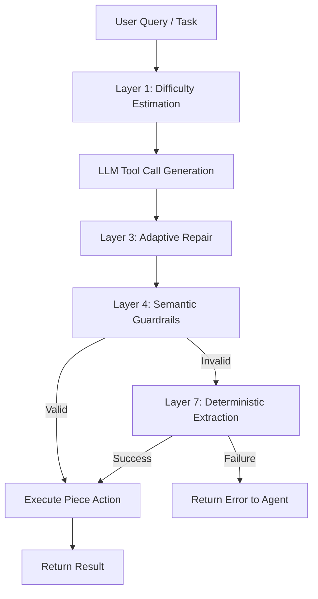
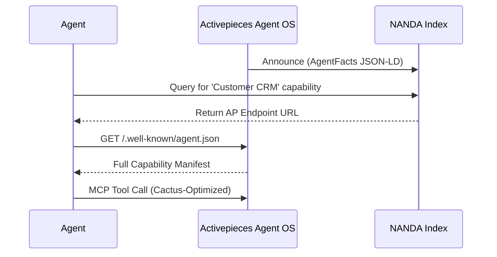
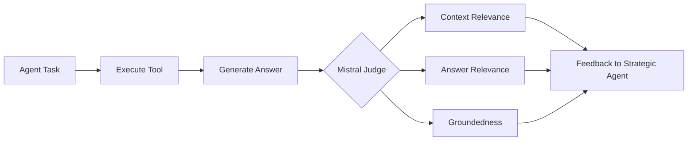
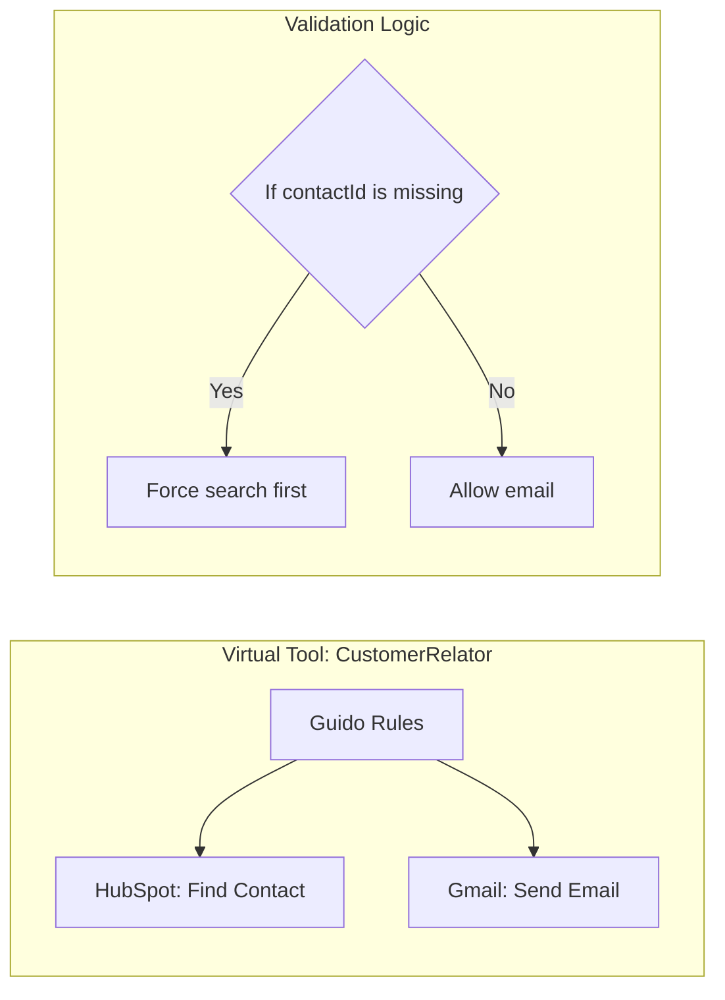

# Agent OS Architecture

This document provides a technical deep-dive into how Agent OS processes tool calls and discovery requests.

## 1. The Cactus-Optimized Execution Pipeline

Every time an AI agent calls an Activepieces tool via MCP, it passes through the **Cactus Adaptive Layer**. This pipeline is designed to rescue failed tool calls and ensure the highest possible success rate.

### Layer Breakdown:
- **Layer 1**: Assesses if the query is "easy", "medium", or "hard" based on verb count and multi-intent markers.
- **Layer 3**: Fixes common formatting issues (e.g., converting "3pm" to 24h format for an integer field).
- **Layer 4**: Cross-references the generated parameters against the original user query to detect hallucinations.
- **Layer 7**: If the LLM fails, we use high-precision regex patterns to extract the intent directly from the user's text.

## 2. Decentralized Discovery (NANDA)

Agent OS doesn't rely on a central registry. Instead, it uses the **NANDA Protocol** to enable peer-to-peer discovery.

## 3. The Evaluation Loop (LLM as a Judge)

Agent OS includes a built-in evaluation layer to ensure the quality of RAG-based tool executions.

## 4. Virtual Tool Orchestration (Guido)

The Guido rule engine allows for the composition of complex, safe interfaces.

