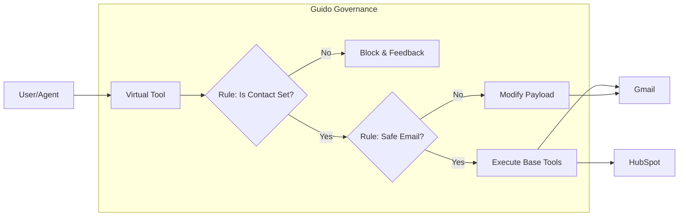
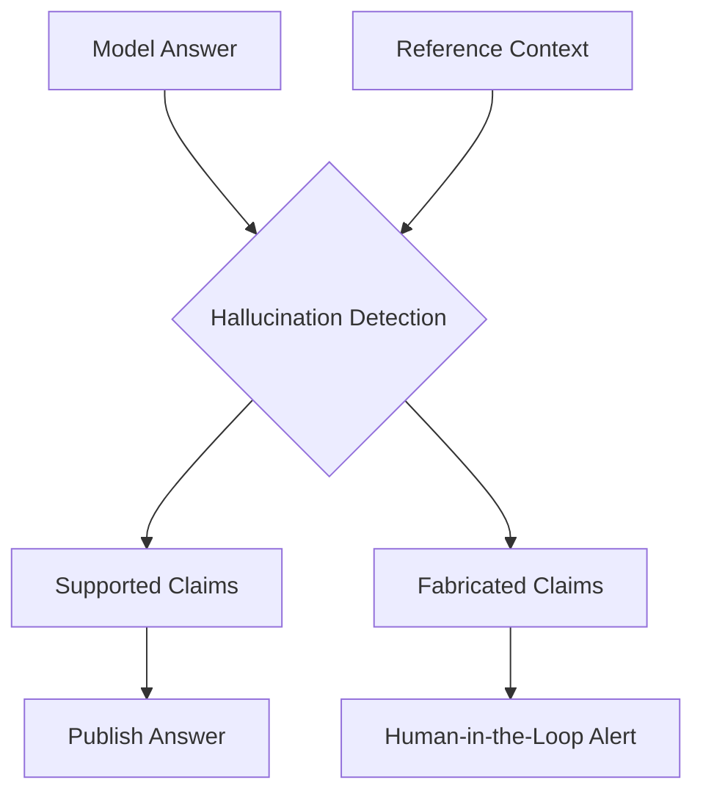

# Route.X User Guide

Learn how to build powerful, AI-ready automations using the Route.X framework.

## 1. Using the Route.X Piece

The **Route.X** piece is your gateway to optimized workflows. Unlike standard integration pieces, it is designed to be called by other LLMs and agents.

### Key Properties:
- **Model Name**: Choose your preferred provider (Mistral Large is recommended for speed/accuracy).
- **Blended Tool Definition**: Map multiple piece actions into a single "Super-Tool".
- **Guido Rules**: Define logic to protect your data.

## 2. Building Virtual Tools

Virtual tools allow you to simplify your agent's life. Instead of giving it access to every single action in HubSpot, give it one virtual tool called `ManageCustomer`.

### Example Definition:
```json
[
  { "piece": "hubspot", "action": "find_contact" },
  { "piece": "hubspot", "action": "update_contact" }
]
```

## 3. Defining Logic-Based Rules (Guido)

Rules ensure that your agent follows your business logic.

### Supported Rules:
- **SET**: Ensures a field must have a value.
- **SET_TO_VALUE**: Ensures a field matches a specific string or number.
- **CONTAINS**: Checks if a list contains an item or a string contains a substring.
- **NOT**: Negates any of the above conditions.

### Example: Protect your Email
"If the `recipient_email` does not contain `@company.com`, then DO NOT allow `send_email` to proceed."



## 4. Discovery & Token Rotation

Every Route.X project has a unique **Discovery Token**.
- You can find your token in the **MCP Settings** page.
- Use this token to register your agent in external indexes or to share it with your team.
- If your token is compromised, use the **Rotate Token** button to instantly invalidate the old one.

## 5. Mistral Optimization & Evaluation

If you are using Mistral AI, Route.X automatically enables **Native Tooling** and advanced **Evaluation Actions**.

### RAG Evaluation Metrics:
- **Context Relevance**: Did the system retrieve information that actually answers the question?
- **Answer Relevance**: Is the final answer helpful and on-point?
- **Groundedness**: Is the answer factually supported by the retrieved context, or did the model hallucinate?

### Hallucination Detection:
Use the **Mistral Hallucination Detection** action in your flows to verify specific claims against a source of truth. It returns a structured report indicating which parts of an answer are supported and which are potentially fabricated.


